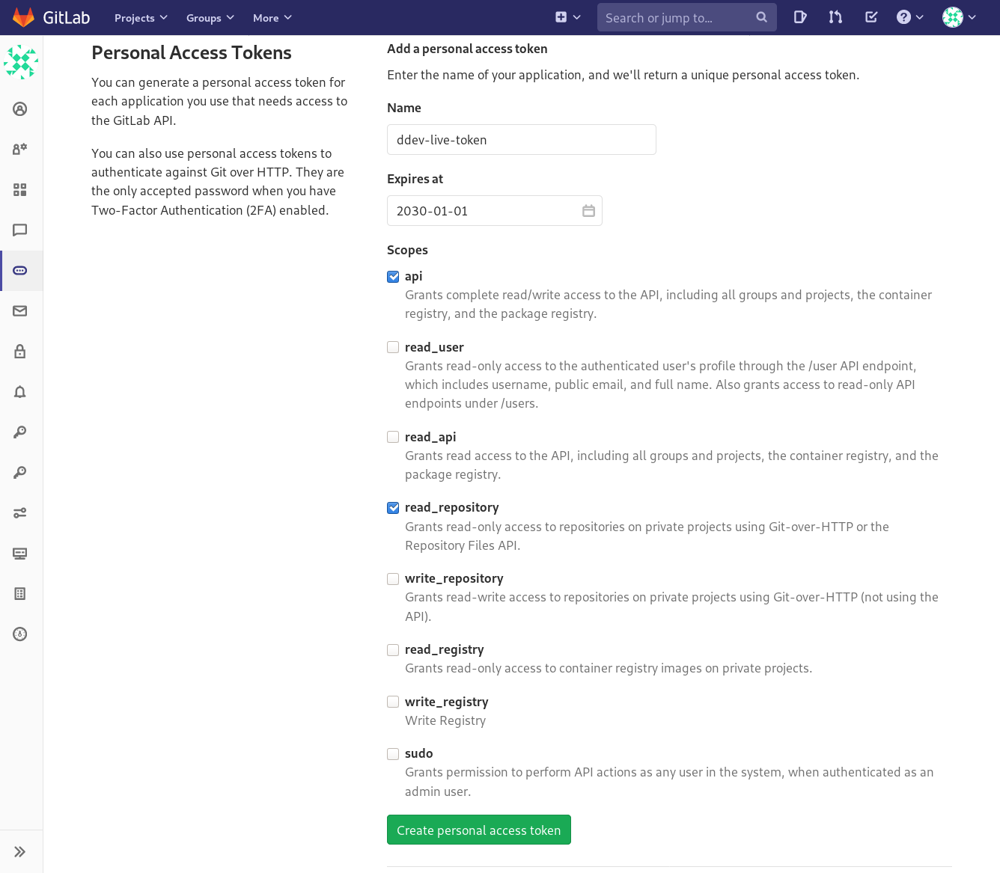
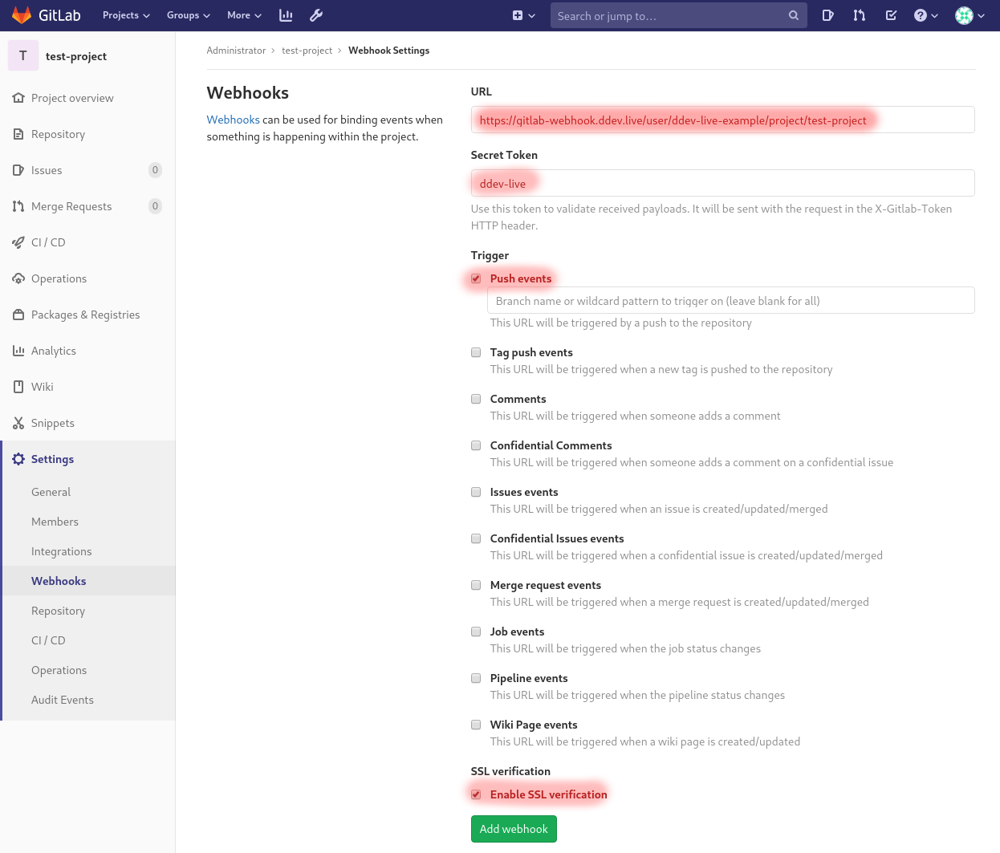

# GitLab

_**Note: This guide applies to GitLab 13.0**_


Integration with GitLab has been designed differently from GitHub. The site creation using our [ddev-live CLI introduces slightly modified and more general purpose flags](https://docs.ddev.com/sites/#gitlab). For publicly available gitlab repositories without any advanced GitLab integration, the CLI flags are all you need. This page describes how to configure credentials and enable webhooks for automatic build triggers.

### Configure Personal Access Token

Create GitLab Personal Access Token and upload it to DDEV-Live to enable site builds from private repositories hosted on GitLab and automatic site builds.

**Create new Personal Access Token**

1) Log in to GitLab. Note your username - it will be used later
2) Head over to `Settings` -> `Access Tokens`
3) Enter a name, expiration date and choose `Scopes`. `read_repository` is required. If you wish to use the automatic [Project Webhook Configuration](#Project-Webhook-Configuration) check the `api` scope as well
4) Create the token
5) Save the newly created token



**Upload Personal Access Token to DDEV-Live**

Use the ddev-live CLI command to upload the token:
```
ddev-live create credentials gitlab <credentials-name> (1) \
    --url=<gitlab-server-hostname> (2) \
    --user=<username> (3) \
    --token=<personal-access-token> (4)
```

* (1) is the unique name of your personal access token in DDEV-Live. Must match `[a-z0-9]([-a-z0-9]*[a-z0-9])?`
* (2) is the hostname of your gitlab server, eg. `https://gitlab.example.com`
* (3) is the username of the logged in user who created the Personal Access Token in GitLab
* (4) is the Personal Access Token

### Project Webhook Configuration

With sufficiently authenticated GitLab personal access token configured, the platform will try to do best effort on configuring webhooks automatically for each project whenever a repository URL is referenced in one of the created sites. You can check the status of the auto-configuration by running a CLI command to describe site details `$ ddev-live describe site <SITE_NAME>`.

You can choose to configure the webhooks manually per project in your GitLab server. The steps may differ based on your gitlab version, following steps are for GitLab 13.0 release:
1) Login to your GitLab instance and go to a desired project `Settings` -> `Webhooks` page.

2) Using ddev-live CLI, run `$ ddev-live describe site <SITENAME>`, under the section `SITE IMAGE`, you can find `GIT SOURCE` and `Status`. This should contain a URL for the GitLab Webhook Settings and Secret Token.

3) Select `Push events` trigger, optionally you can restrict a branch as well, but you can keep that blank to forward events for all branches.

4) Check `Enable SSL verification` to keep the connection between GitLab and ddev secure.

5) Click on `Add webhook`.



### Trigger Site Build Manually

With the ddev-live CLI, you have the option of triggering a site deployment from a certain commit manually,

```
$ ddev-live configure site --git-rev <SHA/TAG/BRANCH>
```

will trigger a build if the git revision differs from previously configured revision. 

### Revoke Access

**Webhook Configuration**

If you use automatic build triggers delete all your sites in DDEV-Live to remove all repository configuration associated with DDEV-Live.
List sites:
```
$ ddev-live list sites
```
Delete sites:
```
$ ddev-live delete site <site-name>
```

**Revoke credentials**

Log in to GitLab and delete the Personal Access Token. 
Optionally delete the revoked token from DDEV-Live as well:
```
$ ddev-live delete credentials gitlab <credentials-name>
```
